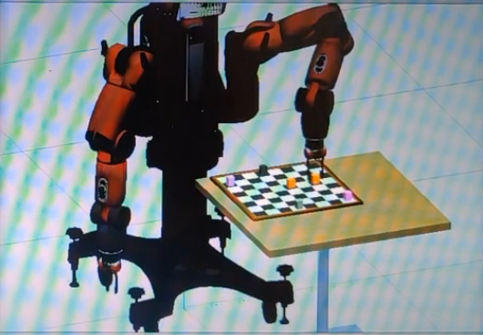

# Robot-Chess-Player

Simulate Baxter the robot playing chess, using the Robot Operating System (ROS) in Gazebo.
Designed for a pre-configured virtualbox VM.

Click the image below to watch a demonstration on YouTube
